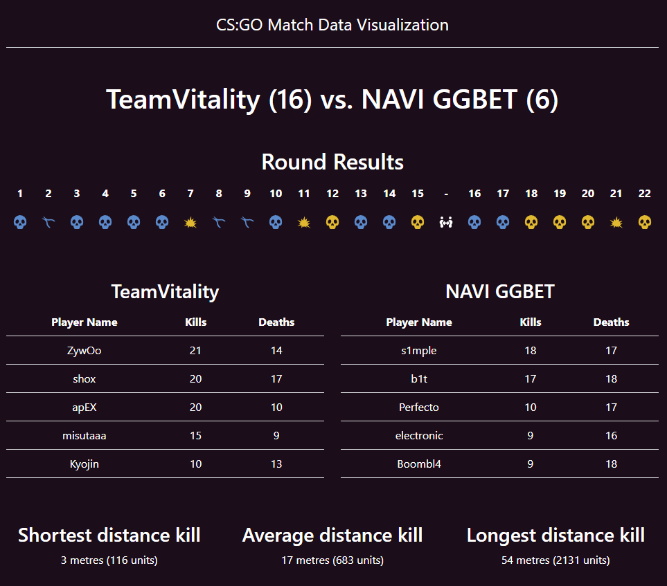

# CS:GO Match Data Parser & Visualization

Extracts data from a srdc log of a professional CS:GO match and exposes certain parsed data via endpoints in an ASP.NET 7 API which is visualized through a React/TypeScript frontend application.
Match file is read and parsed into sensible data upon API startup.

## Prerequisites
Following is required to run the applications.
- [NodeJS TLS](https://nodejs.org/en)
- [.NET 7 SDK](https://dotnet.microsoft.com/en-us/download/dotnet/7.0)

## Run the applications
First off, run the backend to serve the API. Then start the frontend project.

### Backend
- Open a console
- CD into the folder: `backend/CsgoMatchData.Api`
- Run `dotnet run`
- Swagger will be served at: http://localhost:5176/swagger/index.html

### Frontend
- Open a console
- CD into the folder: `frontend`
- Run `npm install`
- Run `npm start`
- App will be served at: http://localhost:3000 